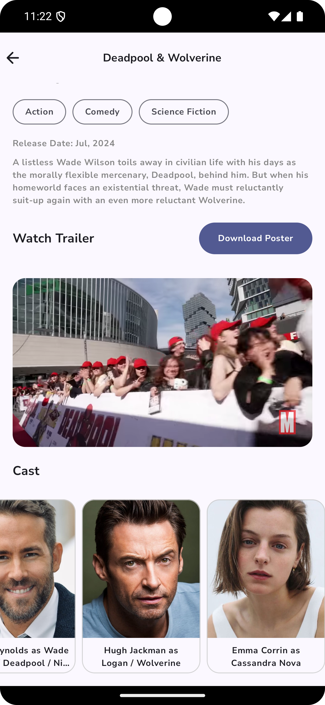
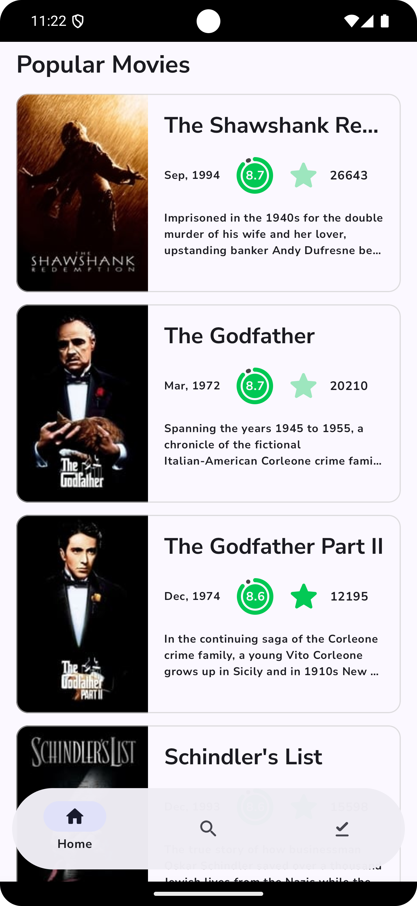

# MoviesApp

MoviesApp is a Kotlin-based Android application that allows users to search for movies, view details, and watch trailers. The app uses  Compose Multiplatform for the UI and Koin for dependency injection and supports IOS,Android and JVM.

## Features

- **Search Movies**: Search for movies, TV shows, and people.
- **View Details**: View detailed information about movies.
- **Watch Trailers**: Watch trailers of movies.
- **Popular Movies**: Browse popular movies.
- **Top Rated Movies**: Browse top-rated movies.
- **Upcoming Movies**: Browse upcoming movies.
- **Now Playing Movies**: Browse movies that are currently playing.
- **Search**: Search Movies

## Technologies Used

- **Kotlin**: Programming language used for development.
- **Multiplatform Compose**: Modern toolkit for building native Android UI.
- **Koin**: Dependency injection framework.
- **Voyager**: Navigation library for Jetpack Compose.
- **Gradle**: Build automation tool.
- **Ktor**: HTTP client for networking.
- **Coroutines**: Asynchronous programming.
- **Serialization**: JSON serialization library.
- **Coil**: Image Loading and Caching
- **JavaFX**: JVM WebView

## Project Structure

- `src/commonMain/kotlin/com/kashif/common/presentation/`: Common presentation logic.
- `src/commonMain/kotlin/com/kashif/common/data/`: Common data logic.
- `src/commonMain/kotlin/com/kashif/common/domain/`: Common domain logic.
- `src/commonMain/kotlin/com/kashif/common/di/`: Common dependency injection logic.
- `src/androidMain/kotlin/com/kashif/android/`: Android-specific logic.
- `src/ioMain/kotlin/com/kashif/ios/`: iOS-specific logic.
- `src/jvmMain/kotlin/com/kashif/jvm/`: JVM-specific logic.
- `iosApp`: iOS-specific configuration and entry point.
- `androidApp`: Android-specific configuration and entry point.
- `jvmMain`: JVM-specific configuration and entry point.

### Screen Shots

<div style="display: flex; gap: 10px;">
    
    
    
    
    
    
</div>


## Getting Started

### Prerequisites

- Android Studio Koala | 2024.1.1 Patch 2
- Kotlin 2.0.0+
- Gradle 8.0+

### Installation

1. **Clone the repository**:
    ```sh
    git clone https://github.com/yourusername/MoviesApp.git
    cd MoviesApp
    ```

2. **Run in Android Studio**:
    - Open the project in Android Studio.
    - Build and run the project.

## Usage

- **Search for Movies**: Use the search bar to find movies, TV shows, or people.
- **View Movie Details**: Click on a movie to view its details.
- **Watch Trailers**: Click on the play button to watch the trailer of a movie on ios, android and jvm.
- **Browse Movies**: Scroll through the lists of popular, top-rated, upcoming, and now-playing movies.

## Contributing

1. **Fork the repository**.
2. **Create a new branch**:
    ```sh
    git checkout -b feature/your-feature-name
    ```
3. **Make your changes**.
4. **Commit your changes**:
    ```sh
    git commit -m 'Add some feature'
    ```
5. **Push to the branch**:
    ```sh
    git push origin feature/your-feature-name
    ```
6. **Open a pull request**.

## License

This project is licensed under the MIT License - see the `LICENSE` file for details.

## Acknowledgements

- [Jetpack Compose](https://developer.android.com/jetpack/compose)
- [Koin](https://insert-koin.io/)
- [Voyager](https://github.com/adrielcafe/voyager)

## Contact

For any inquiries, please contact [kashismails@gmail.com].